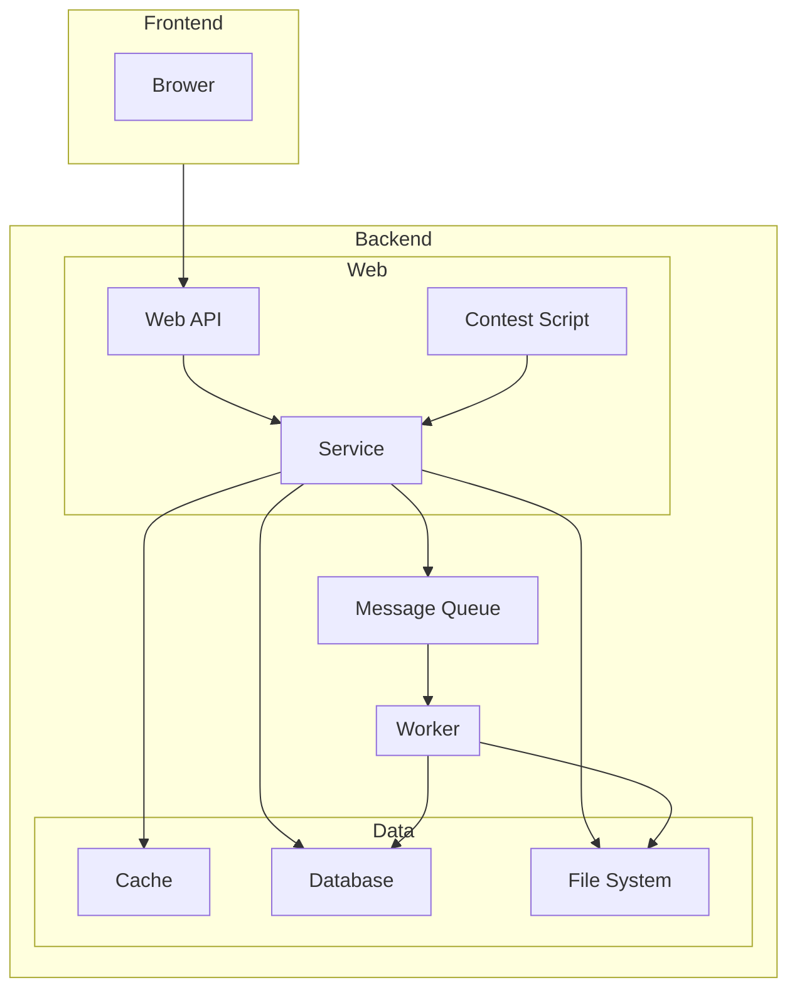

# 架构

运行时整体架构：

## 技术选型

仅为整体的技术选型，更多细节请参考各个模块的文档。

### 前端

- Language：`JavaScript`
- Web Framework: `Solid.js`
- UI: `Hope UI`
- Build：`Vite`

### 后端

Web:

- Language：`Go`
- Web Framework：`Gin`
- Run JavaScript in Go: `Goja`

Database：`MySQL`

Cache：`Redis`

Message Queue：`Redis` (`Redis Stream`)

??? note "Redis Stream 的可用性"
    - Redis Stream 支持「阻塞式」拉取消息。在读取消息时增加 BLOCK 参数即可。
    - 消息有自己的 ID。
    - 消费者处理完消息后，需执行 XACK 命令告知 Redis，这时 Redis 就会把这条消息标记为「处理完成」。若消费者异常宕机，就不会发送 XACK，则 Redis 会保留这条消息。待消费者重新上线后，Redis 会把未处理成功的数据重新发给消费者。这样，即使消费者异常，也不会丢失数据。
    - Redis 可配置持久化，以尽量减少 Redis 意外宕机的损失。

Deploy：

- `Docker`
    - Containers：
        - web
        - mysql
        - redis
        - worker

File System：`Docker Volume`
