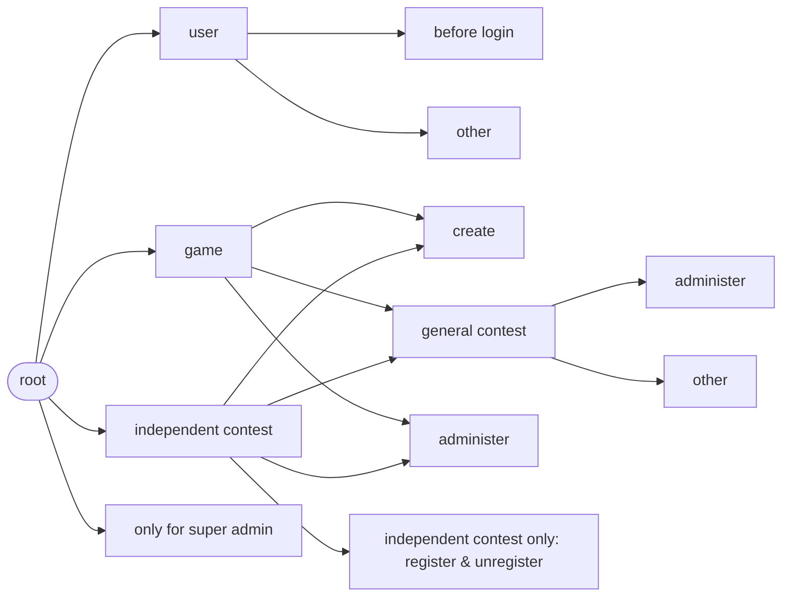
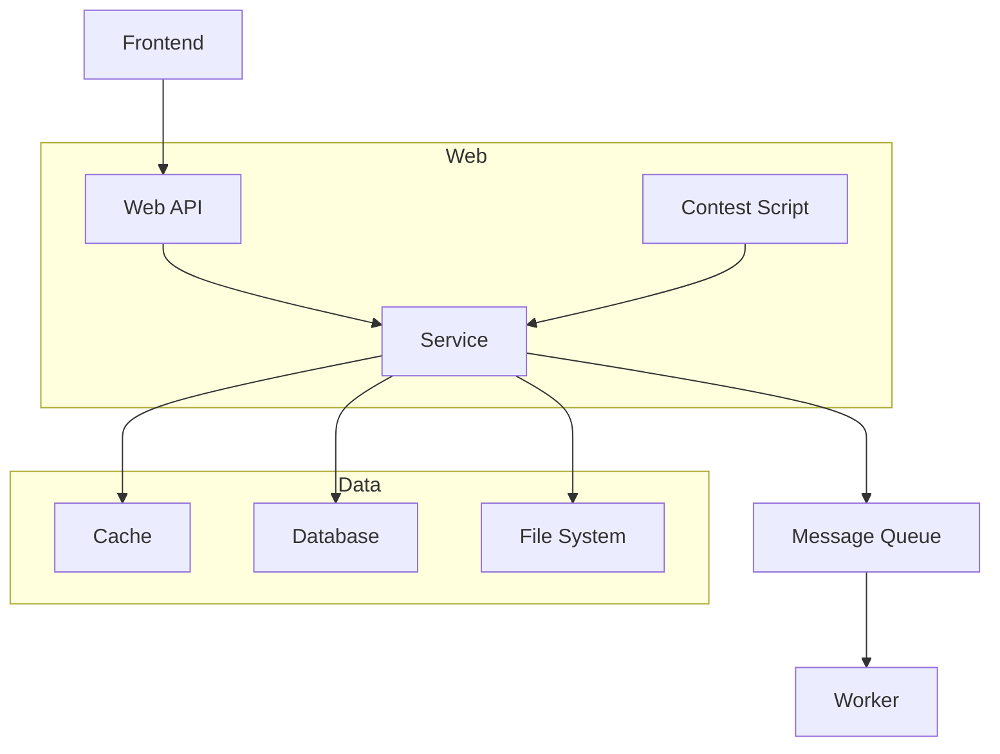
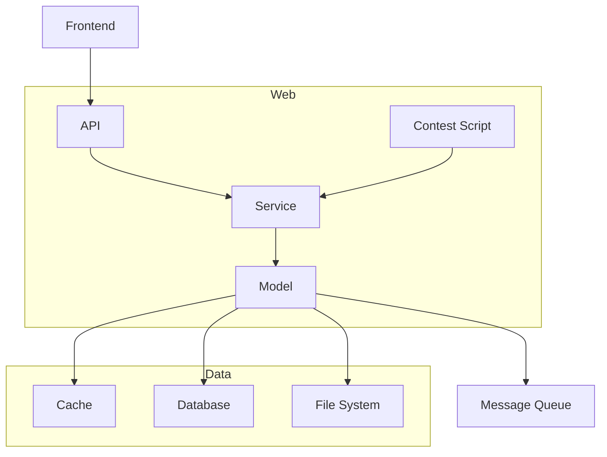

# Web

## 提供给前端的API

[API文档](https://hiper-backend.apifox.cn)

使用 `Apifox` 实现 编写与部署API文档、调试API、简易 Mock、生成类型定义代码。

- [ ] `Apifox` 对 测试API 的支持也还可以，不过要不要用还不一定。

API 设计思路概念图：

## 提供给赛事脚本的API

[赛事脚本API](/user/local-admin/contest-script.md)

若赛事管理员提交了有问题的赛事脚本，则可能导致一些破坏性结果。需尽可能降低这一风险。

但仍相信赛事管理员不会故意提交有问题的赛事脚本，因此不轻易采取强制的限制措施。

可能的破坏性结果：

1. 在短时间内创建了极大量对局，挤占了其他赛事的评测资源。
2. 执行无意义逻辑占用计算资源。

## 内部实现

源码目录：[web](https://github.com/THUAI-ssast/hiper-backend/tree/main/web)

### 整体架构与技术选型

从 [架构](arch.zh.md) 部分抄过来 Web 部分与其他部分的关联：

增加一个 `model` 层，用于封装数据访问。形成如下结构：

- `API` 与 `Contest Script` 部分提供「对外的 API」。
- `Service` 提供「相对干净的业务逻辑」。粒度拆分到足够细，方便组合使用。
    - 遵循 Go 项目的惯例，将 service 拆散平铺到其他目录，合理归类，于是并不需要单独的 service目录。
- `Model` 直接和底层存储系统交互，定义数据模型、提供访问数据的接口，供业务逻辑使用，使 `Service` 与底层存储系统解耦（如不用管到底要不要缓存），也使得 `Service` 更加干净。
    - 因此，这部分的接口设计是「业务驱动」的——业务需要什么就封装出什么。

### Model

参考技术选型：

- [github.com/go-sql-driver/mysql](https://github.com/go-sql-driver/mysql)
- [gorm.io/gorm](https://gorm.io)
- [github.com/redis/go-redis](https://redis.uptrace.dev/zh/)
    - If you are using Redis 6, install go-redis/v8.
	- If you are using Redis 7, install go-redis/v9.

Apifox 可从数据结构（具体有 请求参数、返回响应、数据模型）生成 Go 类型定义代码、SQL 语句，供复制粘贴参考。GORM 有一系列默认约定，可减少很多这方面的琐碎代码；并且支持嵌入结构体，与 Apifox 的数据模型设计相契合。

### Contest Script

技术选型：

- [github.com/dop251/goja](https://github.com/dop251/goja). 功能挺全，性能也不错。
- [github.com/dop251/goja_nodejs](https://github.com/dop251/goja_nodejs)

### Config

- 定死后一定不需要修改的，就不要配置。

- [ ] `viper` 对配置热重载支持得很好。如果有的配置确有在运行时修改的合理需求，可以考虑满足。

### TODO: 其他重难点 Service 的实现思路分析（若值得记录）
