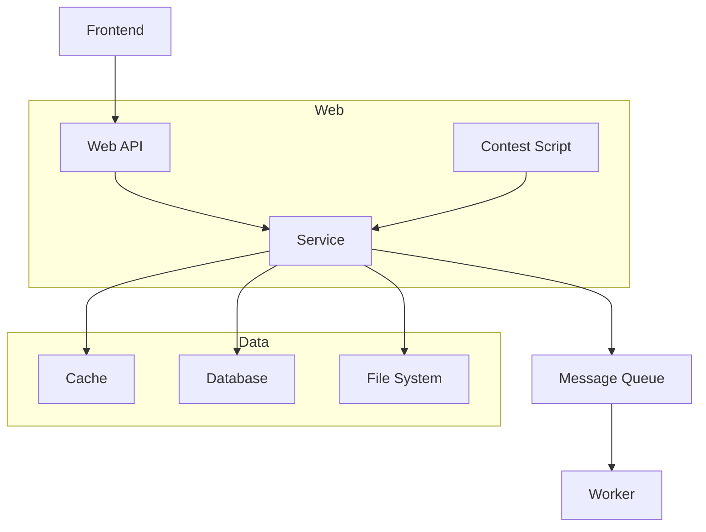
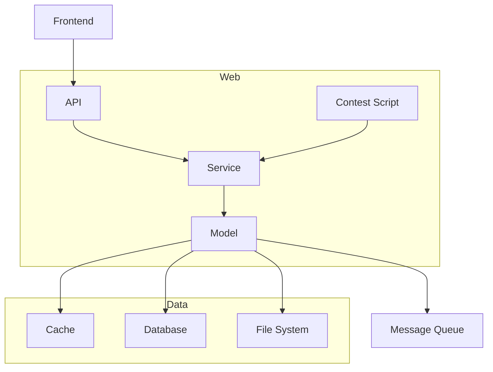

# Web

## 提供给前端的API

[API文档](https://hiper-backend.apifox.cn)

使用 `Apifox` 实现 编写与部署API文档、调试API、简易 Mock、生成类型定义代码。

- [ ] `Apifox` 对 测试API 的支持也还可以，不过要不要用还不一定。

API 设计思路概念图：


## 提供给赛事脚本的API

[赛事脚本API](/user/local-admin/contest-script.md)

若赛事管理员提交了有问题的赛事脚本，则可能导致一些破坏性结果。需尽可能降低这一风险。

但仍相信赛事管理员不会故意提交有问题的赛事脚本，因此不轻易采取强制的限制措施。

可能的破坏性结果：

1. 在短时间内创建了极大量对局，挤占了其他赛事的评测资源。
2. 执行无意义逻辑占用计算资源。

## 内部实现

源码目录：[web](https://github.com/THUAI-ssast/hiper-backend/tree/main/web)

### 整体架构与技术选型

从 [架构](arch.zh.md) 部分抄过来 Web 部分与其他部分的关联：



增加一个 `model` 层，用于封装数据访问。形成如下结构：



- `API` 与 `Contest Script` 部分提供「对外的 API」，其中 `Contest Script` 是将 Go 代码封装为 JavaScript 代码，供赛事脚本使用。
    - [`package api`](https://github.com/THUAI-ssast/hiper-backend/tree/main/web/api)
    - [`package contestscript`](https://github.com/THUAI-ssast/hiper-backend/tree/main/web/contestscript)
- `Service` 提供「相对干净的业务逻辑」。粒度拆分到足够细，方便组合使用。
    - 遵循 Go 项目的惯例，将 service 拆散平铺到其他目录，合理归类，于是并不需要单独的 service目录。
    - 每块业务逻辑对应一个 package，如 [`package mail`](https://github.com/THUAI-ssast/hiper-backend/tree/main/web/mail)、[`package user`](https://github.com/THUAI-ssast/hiper-backend/tree/main/web/user)。
- `Model` 解决数据存取、持久化、缓存等问题。提供访问数据的接口供业务逻辑使用，使 `Service` 与底层存储系统解耦（如不用管到底要不要缓存、存到数据库/Redis还是文件系统 等）。
    - [`package model`](https://github.com/THUAI-ssast/hiper-backend/tree/main/web/model)

技术选型：

- web framework: [github.com/gin-gonic/gin](https://github.com/gin-gonic/gin)
- auth: [github.com/golang-jwt/jwt](https://github.com/golang-jwt/jwt)

- config: [github.com/spf13/viper](https://github.com/spf13/viper)

- orm: [gorm.io/gorm](https://gorm.io/gorm)
- redis client: [github.com/go-redis/redis/v9](https://github.com/go-redis/redis/v9) 

- postgres driver: [gorm.io/driver/postgres](https://gorm.io/driver/postgres)

### Model

数据模型间的关系粗略介绍如下：

中心的表：user, game, contest。由于 game 内置一个赛事，故与 contest 有大部分字段是相同的，这部分抽象出 base contest。

game/contest 含有 admins 字段，关联 user；含有 game_id 字段，关联 game。

game/contest 之中还有一些实体需要建表：contestant; ai, match, sdk。它们都与 game/contest 有关联。在此基础上：

contestant 记录 user 参加 game/contest 的情况，关联 user；记录 contestant 指定的出战 ai，关联 ai。

ai, match, sdk 需编号，并决定在每个游戏/赛事中独立编号。

ai 记录提交者，关联 user；记录 ai 所用的 sdk，关联 sdk。

match 记录参加对局的多个 ai，关联 ai。

文件系统中的目录结构粗略示例如下：

```text
var/hiper/
├── contests
│   └── 1
│       ├── ais
│       ├── matches
│       └── sdks
└── games
    └── 1
        ├── ais
        │   ├── 1
        │   │   ├── bin
        │   │   └── src
        │   └── 2
        │       └── src
        ├── game_logic
        │   ├── bin
        │   └── src
        ├── match_detail
        │   └── helpers
        ├── matches
        │   └── 1
        │       ├── player_0.log
        │       ├── player_1.log
        │       ├── player_2.log
        │       └── replay.json
        └── sdks
            └── 1
                └── src
```

每个文件内的代码的组织粗略如下：

```go
// ...

// 数据模型定义

// CRUD. 不一定需要全部实现，视情况而定。也可能有的实现了但不对外暴露，只供内部简化代码。

// CRUD 之 Create
// 可能会有 BeforeCreate、AfterCreate 等 hook
func CreateXxx(obj *Xxx) error

// CRUD 之 Read
// 有时无 filter，返回所有（等效于 filter 填空接口）
// fields 指定返回的字段. 可以不指定，则选择所有字段。
// 有时还会有分页、排序等需求，此时参数过多，封装在结构体 QueryParams 里。
func GetXxxs(filter map[string]interface{}, fields ...string) ([]Xxx, error)
func GetXxxById(id int, fields ...string) (Xxx, error)
func GetXxx(condition map[string]interface{}, fields ...string) (Xxx, error)
// 有时会有一些特殊的查询需求
func SearchXxxs(...) ([]Xxx, error)

// CRUD 之 Update
// 总体类似 Read
func UpdateXxx...(...) error

// CRUD 之 Delete
// 总体类似 Read，但参数更简单
func DeleteXxx...(...) error

// associations CRUD

// 一些特殊、非常规的操作
```

### Contest Script

技术选型：

- [github.com/dop251/goja](https://github.com/dop251/goja). 功能挺全，性能也不错。
- [github.com/dop251/goja_nodejs](https://github.com/dop251/goja_nodejs)

### TODO: 其他重难点 Service 的实现思路分析（若值得记录）
