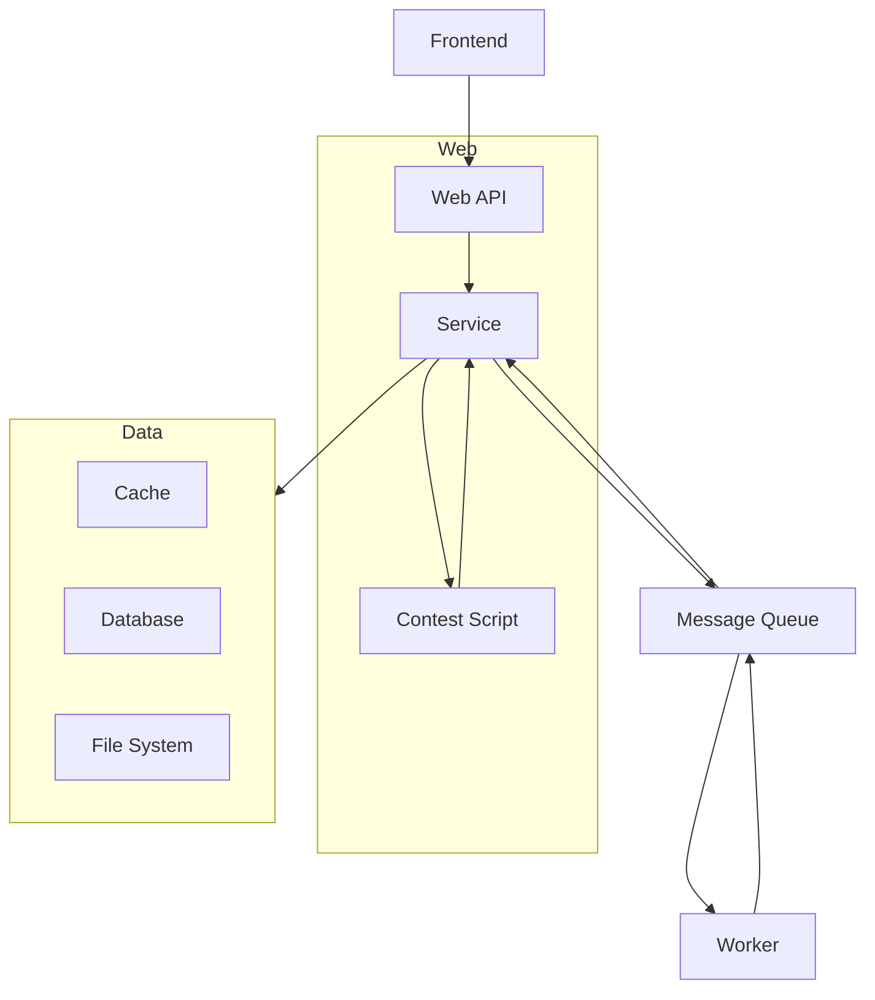
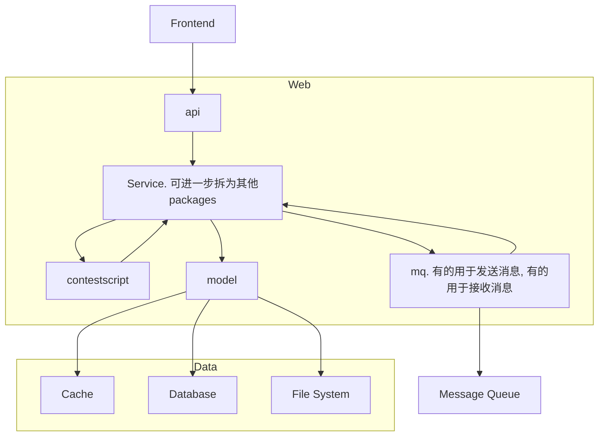

# Web

## 提供给前端的API

[API文档](https://hiper-backend.apifox.cn)

使用 `Apifox` 实现 编写与部署API文档、调试API、简易 Mock、生成类型定义代码。

- [ ] `Apifox` 对 测试API 的支持也还可以，不过要不要用还不一定。

API 设计思路概念图：

<!-- TODO -->

```mermaid
graph LR
```

## 提供给赛事脚本的API

[赛事脚本API](/user/local-admin/contest-script.md)

若赛事管理员提交了有问题的赛事脚本，则可能导致一些破坏性结果。需尽可能降低这一风险。

但仍相信赛事管理员不会故意提交有问题的赛事脚本，因此不轻易采取强制的限制措施。

可能的破坏性结果：

1. 在短时间内创建了极大量对局，挤占了其他赛事的评测资源。
2. 执行无意义逻辑占用计算资源。

## 内部实现

源码目录：[web](https://github.com/THUAI-ssast/hiper-backend/tree/main/web)

### 整体架构

从 [架构](arch.zh.md) 部分抄过来 Web 部分与其他部分的关联：



在 Web 中增加一些模块封装与外部的交互，使得 `Service` 只需关注业务逻辑。

如 添加 `package model` 专门解决数据存取、持久化、缓存等问题。提供访问数据的接口供业务逻辑使用，使 `Service` 与底层存储系统解耦（如不用管到底要不要缓存、存到数据库/Redis还是文件系统 等）。

Web 部分的架构图（以下纯小写表示 package 名）：



`Service` 提供「相对干净的业务逻辑」。粒度拆分到足够细，方便组合使用。

遵循 Go 项目的惯例，将 service 拆散平铺到其他目录，合理归类，于是并不需要单独的 service目录。

每块业务逻辑对应一个 package，如 [`package mail`](https://github.com/THUAI-ssast/hiper-backend/tree/main/web/mail)、[`package user`](https://github.com/THUAI-ssast/hiper-backend/tree/main/web/user)。

### [config](https://github.com/THUAI-ssast/hiper-backend/tree/main/web/config)

`config` 读取配置文件，将配置信息提供给其他模块使用。

技术选型： [github.com/spf13/viper](https://github.com/spf13/viper)

使用 `toml` 格式的配置文件，同时支持环境变量。配置文件支持热重载。

### [api](https://github.com/THUAI-ssast/hiper-backend/tree/main/web/api)

`api` 提供给前端的 API。

技术选型：

- web framework: [github.com/gin-gonic/gin](https://github.com/gin-gonic/gin)
- auth: [github.com/golang-jwt/jwt](https://github.com/golang-jwt/jwt)

### [contestscript](https://github.com/THUAI-ssast/hiper-backend/tree/main/web/contestscript)

`contestscript` 运行赛事脚本。将 Go 代码封装为 JavaScript 代码，供赛事脚本使用。

技术选型：

- [github.com/dop251/goja](https://github.com/dop251/goja). 功能挺全，性能也不错。
- [github.com/dop251/goja_nodejs](https://github.com/dop251/goja_nodejs)

### [model](https://github.com/THUAI-ssast/hiper-backend/tree/main/web/model)

`model` 解决数据存取、持久化、缓存等问题，提供访问数据的接口供业务逻辑使用。

技术选型：

- db: PostgreSQL
- cache: Redis
- orm: [gorm.io/gorm](https://gorm.io/gorm)
- postgres driver: [gorm.io/driver/postgres](https://gorm.io/driver/postgres)
- redis client: [github.com/go-redis/redis/v9](https://github.com/go-redis/redis/v9) 

数据模型设计的核心思路略如下：

中心的表：`user`, `game`, `contest`。由于 `game` 内置一个赛事，故与 `contest` 有大部分字段是相同的，这部分抽象出 `base contest`，这样 `ai`、`match`、`sdk` 等都只需与 `base contest` 关联即可。

约定 `game`, `contest` 的 ID 与它们对应的 `base contest` 的 ID 相同，这样无需额外的字段来关联它们。

`contestant` 记录 `user` 参加 `base contest` 的情况。

`base contest` 内部有 `ai`, `match`, `sdk` 这些东西。这些东西需编号，使用全局编号即可。

> 本打算在每场赛事中独立编号，但发现这样明显提高了实现难度，而且也没有什么必要，便还是只使用全局编号。

文件系统中的目录结构粗略示例如下：

```text
var/hiper/
├── ais
│   ├── 1
│   │   ├── bin
│   │   └── src
│   └── 2
│       └── src
├── games
│   └── 1 # 将来可能还会添加 match detail 的辅助文件等游戏资源，故 game logic 放在单独的目录
│       └── game_logic
│           ├── bin
│           └── src
├── matches
│   └── 1
│       ├── player_0.log
│       ├── player_1.log
│       ├── player_2.log
│       └── replay.json
└── sdks
    └── 1
        └── src
```

每个文件内的代码的组织粗略如下：

```go
// ...

// 数据模型定义

// 主体的 CRUD

// associations CRUD

// 一些特殊、非常规的操作
```

### [mq](https://github.com/THUAI-ssast/hiper-backend/tree/main/web/mq)

`mq` 封装了消息队列的使用，提供发送、接收消息的接口供其他模块使用。

技术选型：

- 消息队列：Redis Stream
- client: [github.com/go-redis/redis/v9](https://github.com/go-redis/redis/v9) 

<!-- TODO -->

### 其他 Service

<!-- TODO -->

`basecontest`, `contest`, `game`, `user` 等。
